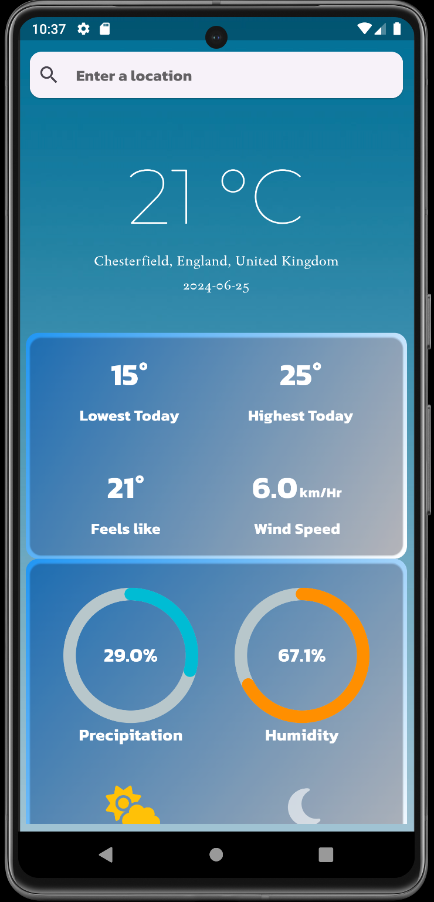
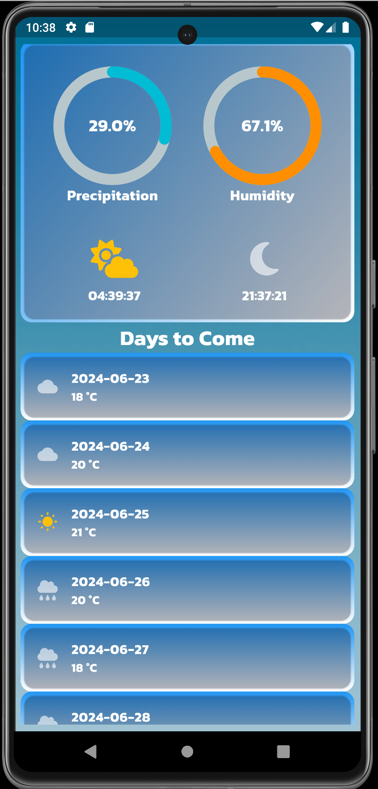
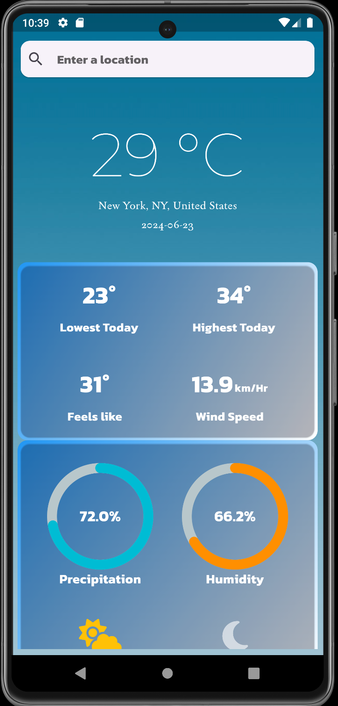

<h1 align="center">
  <strong><code>WeatherX</code></strong>
</h1>

  

<h3 align="center">
  <strong>A basic weather application developed using Flutter and Dart.</strong>
</h3>

## 📌 Key Features

* **Current Weather**: Displays accurate weather data of your <code>current location</code> on the home page.

* **Search Functionality**: Easily search for weather data of specific locations using the <code>integrated search bar</code>.

* **Future Predictions**: Provides an option to <code>switch the date</code> to any of the coming 15 dates, and displays the weather data
  of that specific date.

* **Comprehensive Weather Information**: Provides <code>detailed information</code> including current temperature, daily minimum and maximum temperatures,
feels-like temperature, wind-speed, probability of precipitation, humidity in the air, sunrise and sunset timings at the current/searched location
of a given day.

## 📡 APIs Used

* <code>[Visual Crossing](https://www.visualcrossing.com/)</code>
* <code>[Boundaries-io](https://rapidapi.com/VanitySoft/api/boundaries-io-1)</code>

  
## 👁️ Preview

Home Page             |               Change Dates                |               Change Locations               | No Result Page
:-------------------:|:-----------------------------------------:|:--------------------------------------------:|:----------------------:
 |  |  |

The location displayed on the home page is the default location of the emulator (Pixel 7 Pro API 28) used.
## 📕 Project Context

* This project was primarily a learning exercise aimed at enhancing my Flutter and Dart skills. Consequently, the code may not represent the best possible
  implementation of the app.
* Any suggestions regarding the appearance or funtionality of the application will be much appreciated.
##
[Licensed by MIT](https://github.com/im-lakshyaveerturna/WeatherX/blob/main/LICENSE)
