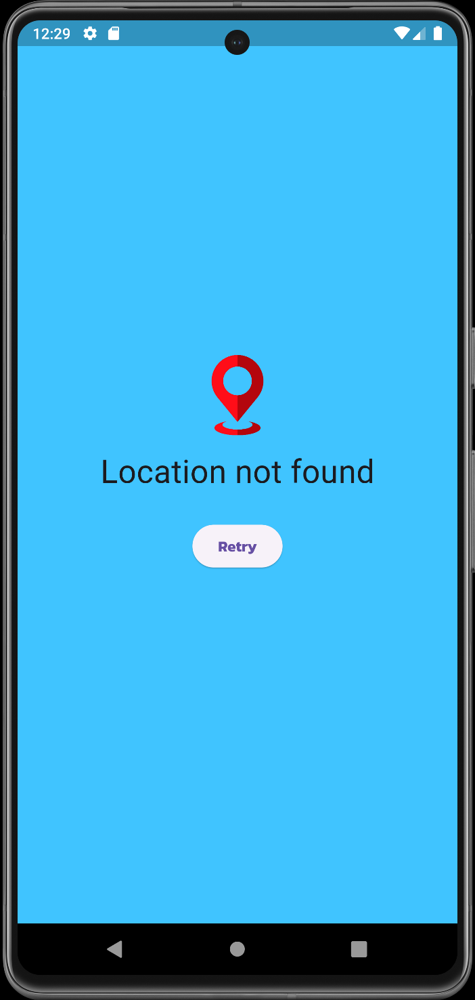

<h1 align="center">
  <strong>WeatherX</strong>
</h1>

  

<h3 align="center">
  <strong>A basic weather application developed using Flutter and Dart.</strong>
</h3>

## 📌 Key Features

* **Current Weather**: Tracks your current location, to display accurate weather data of that location at the home page.

* **Search Functionality**: Easily search for weather data of specific locations using the integrated search bar.

* **Future Predictions**: Provides an option to switch the date to any of the coming 15 dates, and displays the weather data
  of that specific date.

* **Comprehensive Weather Information**: Provides detailed information including current temperature, daily minimum and maximum temperatures,
feels-like temperature, wind-speed, probability of precipitation, humidity in the air, sunrise and sunset timings at the current/searched location
for a given day.

## 📡 APIs Used

* [Visual Crossing](https://www.visualcrossing.com/)
* [Boundaries-io](https://rapidapi.com/VanitySoft/api/boundaries-io-1)

  
## 👁️ Preview

Home Page             |               Change Dates                |               Change Locations               | No Result Page
:-------------------:|:-----------------------------------------:|:--------------------------------------------:|:----------------------:
 |  |  |

## 📕 Project Context

* This project was primarily a learning exercise aimed at enhancing my Flutter and Dart skills. Consequently, the code may not represent the best possible
  implementation of the app.

##
[Licensed by MIT](https://github.com/im-lakshyaveerturna/WeatherX/blob/main/LICENSE)
